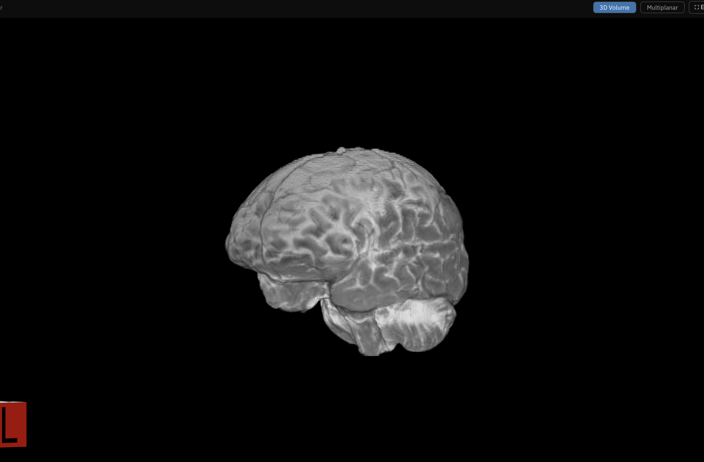
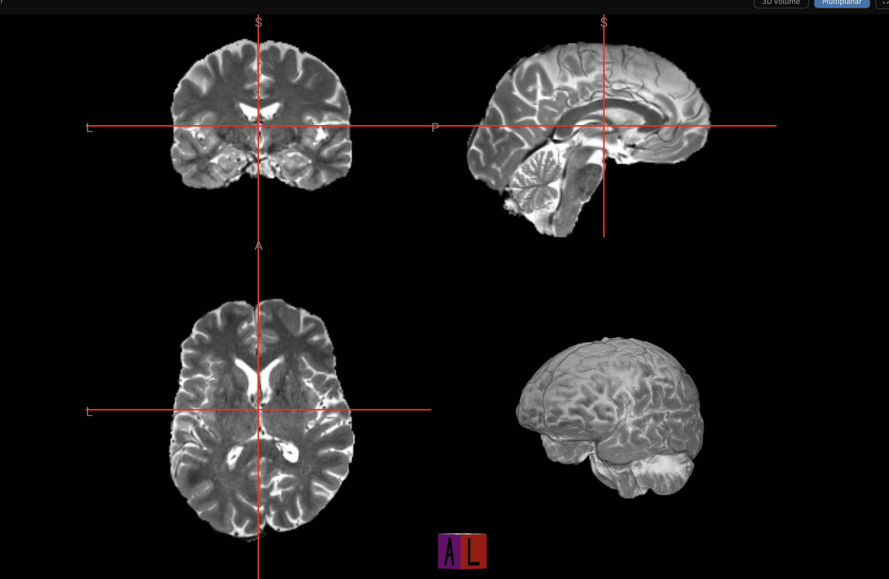
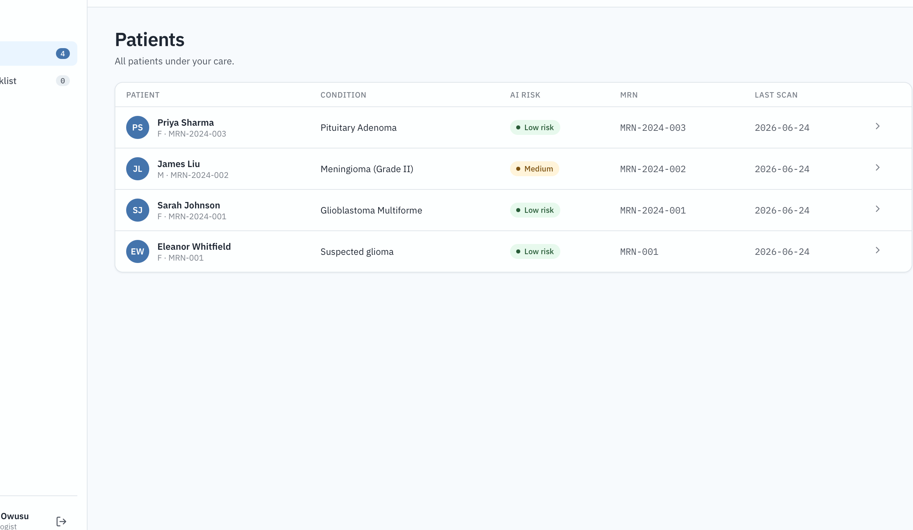
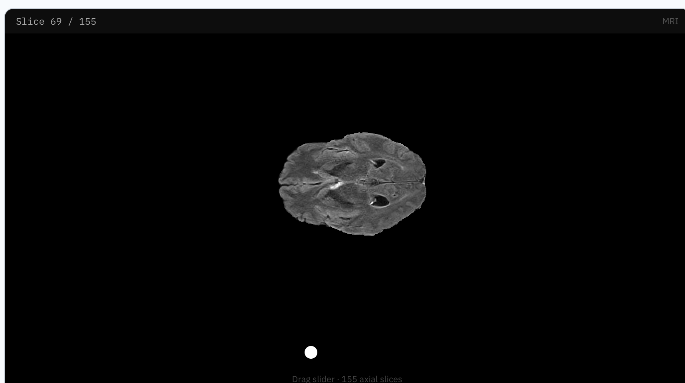
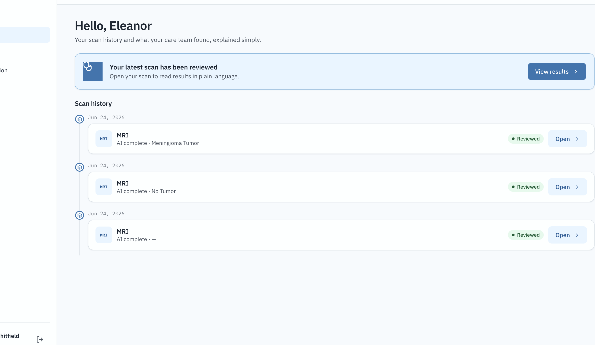
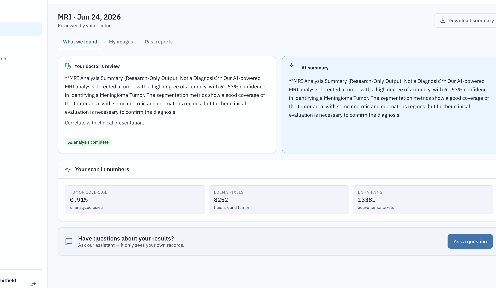
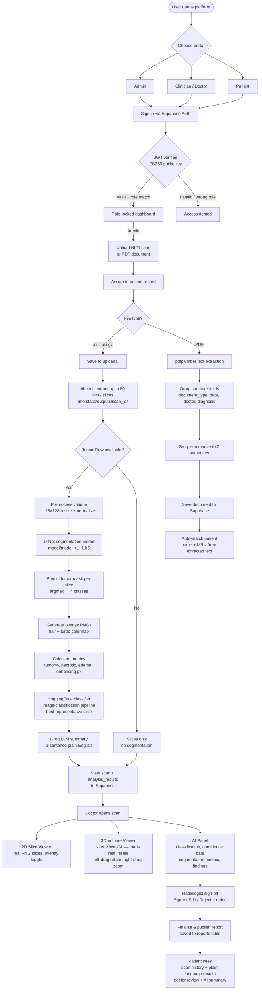

# BrainTumor AI

A full-stack clinical MRI intelligence platform that combines AI-powered tumor segmentation, 3D volumetric visualization, and a shared clinical record connecting imaging teams, clinicians, and patients — all behind role-locked portals with real authentication.

---

## Screenshots

| 3D Volume Render | Multiplanar View |
|---|---|
|  |  |

| Doctor — Patient List | 2D Slice Viewer |
|---|---|
|  |  |

| Patient — Scan History | Patient — AI Results |
|---|---|
|  |  |

---

## How It Works — Full Flow



---

## Architecture

```
Browser (React 18, no build step)
    │
    │  HTTP + Bearer JWT
    ▼
FastAPI (Python 3.11, Uvicorn)
    ├── auth.py          ← verifies Supabase ES256 JWT
    ├── app.py           ← /detect_tumor, ML pipeline, slice extraction
    └── routes/
        ├── patients.py  ← patient CRUD, timeline, scans
        ├── scans.py     ← scan detail, reports, annotations
        ├── documents.py ← PDF/image upload, OCR, auto-assign
        └── chat.py      ← LLM Q&A per patient
    │
    │  supabase-py (service role key)
    ▼
Supabase (PostgreSQL + Auth)
    ├── auth.users       ← user accounts + metadata (role)
    ├── profiles         ← role, display name
    ├── patients         ← medical records, MRN, risk, assigned doctor
    ├── scans            ← NIfTI uploads, status, nii_url
    ├── analysis_results ← segmentation metrics, classifier output, AI summary
    ├── documents        ← PDF/image OCR results, structured fields
    ├── reports          ← doctor sign-off decisions
    └── annotations      ← doctor drawings and notes per slice
```

---

## Stack

| Layer | Technology |
|---|---|
| Backend | Python 3.11, FastAPI, Uvicorn |
| Frontend | React 18 (CDN + Babel, no build step) |
| Database / Auth | Supabase (PostgreSQL + Auth) |
| ML — Segmentation | TensorFlow / Keras U-Net (`.h5` model, 4-class) |
| ML — Classification | HuggingFace Transformers (`image-classification` pipeline) |
| LLM — Summaries | Groq (llama-3.1-8b-instant) |
| 3D Viewer | NiiVue 0.69.0 (WebGL, bundled locally) |
| MRI Processing | nibabel, matplotlib, OpenCV |
| PDF OCR | pdfplumber |

---

## User Roles

### Admin
- Upload NIfTI scans (`.nii` / `.nii.gz`) and assign them to patients
- Upload PDFs — system auto-matches patient from document text (name + MRN)
- Create new patient records (name, DOB, sex, MRN, condition, risk level)
- View all patients, manage records

### Clinician (Doctor)
- View all assigned patients with risk badges and MRN
- Open patient clinical timeline — chronological view of scans, documents, reports
- Launch scan viewer:
  - **2D Slices** — navigate up to 80 real extracted MRI slices with overlay toggle
  - **3D Volume** — WebGL NiiVue render of the full NIfTI (rotate, zoom, multiplanar)
- Read AI panel: tumor classification, confidence bars, segmentation metrics, findings
- Finalize a report: Agree / Edit / Reject the AI output, add clinical notes, publish

### Patient
- See own scan history and status
- View plain-language AI summary and doctor's review per scan
- See segmentation metrics: tumor coverage %, edema pixels, enhancing pixels
- Ask questions via LLM chat (Groq-powered, context-aware per patient record)

---

## AI Pipeline — Step by Step

### 1. Upload & Storage
Admin uploads a `.nii` or `.nii.gz` file via the Upload queue and assigns it to a patient. The file is saved to `uploads/{patient_id}/{scan_id}/filename.nii`.

### 2. Slice Extraction (always runs)
`nibabel` loads the NIfTI volume and samples up to 80 evenly-spaced axial slices. Each slice is normalized (min-max) and saved as a grayscale PNG to `static/outputs/{scan_id}/flair_NNN.png`. This works even if TensorFlow is unavailable.

### 3. Segmentation (requires TensorFlow)
The volume is resized to 128×128 per slice, normalized, and fed into a U-Net model (`model/model_x1_1.h5`). The model outputs a 4-class prediction mask per slice:
- Class 0 — background (no tumor)
- Class 1 — necrotic core
- Class 2 — peritumoral edema
- Class 3 — enhancing tumor

Overlay PNGs are generated by blending the grayscale MRI slice with the turbo-colormap mask at 48% opacity, saved to `static/outputs/{scan_id}/overlay_NNN.png`.

### 4. Metrics
From the full prediction volume:
- `tumor_percentage` — % of all pixels with class > 0
- `necrotic_pixels` — count of class 1 predictions
- `edema_pixels` — count of class 2 predictions
- `enhancing_pixels` — count of class 3 predictions

### 5. Classification
The slice with the most tumor pixels is selected as representative. It is passed through a HuggingFace `image-classification` pipeline (configurable via `HF_MODEL_ID`) which returns top-k labels with confidence scores (e.g. "Meningioma Tumor — 61.5%").

### 6. LLM Summary
Metrics + classification result are sent to Groq (`llama-3.1-8b-instant`) which generates a 2-sentence plain-English clinical summary. Falls back to a local template summary if no Groq API key is set.

### 7. Database Persistence
All results are stored in Supabase:
- `scans` — file path, modality, status, `nii_url`
- `analysis_results` — metrics (JSONB), classifier label, confidence, AI summary, structured findings

---

## Document Pipeline

```
Upload PDF / image
       │
       ├─ PDF with text layer ──► pdfplumber extract ──► Groq structure fields
       │                                                   (type, date, doctor,
       │                                                    patient name, diagnosis)
       │                                                       │
       │                                              Groq 2-sentence summary
       │                                                       │
       └─ Scanned image ──► (Vision OCR — configure            │
                              ANTHROPIC_API_KEY)               │
                                                               ▼
                                                   Save to documents table
                                                               │
                                                   Auto-match patient:
                                                   extract name + MRN from text,
                                                   score against patients table,
                                                   pre-fill dropdown if matched
```

---

## Authentication Flow

```
User enters email + password
         │
         ▼
Supabase Auth REST endpoint
(/auth/v1/token?grant_type=password)
         │
         ▼
Returns access_token (ES256 JWT)
         │
Stored in sessionStorage
         │
Every API request: Authorization: Bearer <token>
         │
         ▼
auth.py: PyJWT decode with embedded EC public key
         │
Validates: signature, expiry, user ID
         │
         ▼
Supabase profiles table → role (admin/doctor/patient)
         │
Role must match the portal the user signed into
         │
         ▼
Request proceeds or 403 Forbidden
```

---

## Database Schema (key tables)

| Table | Key columns |
|---|---|
| `profiles` | `id` (FK auth.users), `role`, `full_name` |
| `patients` | `id`, `user_id`, `full_name`, `dob`, `sex`, `mrn`, `condition`, `risk`, `assigned_doctor_id` |
| `scans` | `id`, `patient_id`, `file_path`, `nii_url`, `modality`, `status` |
| `analysis_results` | `scan_id`, `segmentation_metrics` (JSONB), `classifier_label`, `confidence`, `structured_findings` (JSONB) |
| `documents` | `patient_id`, `original_name`, `source_type`, `extracted_text`, `structured_fields`, `ai_summary` |
| `reports` | `scan_id`, `doctor_id`, `decision` (agree/edit/reject), `notes`, `status` (draft/final) |
| `annotations` | `scan_id`, `doctor_id`, `shape_type`, `note`, `decision` |

Row-level security (RLS) is enabled on all tables. Admins see everything; doctors see only assigned patients; patients see only their own records.

---

## Project Structure

```
├── app.py                   # FastAPI entry point, ML pipeline, NIfTI processing
├── auth.py                  # ES256 JWT verification (Supabase public key)
├── db.py                    # Supabase admin client (service role)
├── seed_data.py             # Demo data seeder (3 patients + documents)
├── routes/
│   ├── patients.py          # Patient CRUD, timeline endpoint
│   ├── scans.py             # Scan detail, reports, annotations
│   ├── documents.py         # Upload, OCR, suggest-patient endpoint
│   └── chat.py              # LLM Q&A endpoint
├── static/
│   ├── css/design.css       # Full design system (tokens, components)
│   └── js/
│       ├── app.js           # Portal landing + auth flow
│       ├── admin.js         # Admin portal (upload, patients, accounts)
│       ├── doctor.js        # Clinician portal (timeline, scan detail, sign-off)
│       ├── patient.js       # Patient portal (history, results, chat)
│       ├── api.js           # Fetch wrapper + Supabase sign-in
│       ├── ui.js            # Shared components (AIPanel, Sidebar, Topbar)
│       ├── real_viewer.js   # 2D MRI PNG slice viewer
│       ├── niivue_viewer.js # 3D WebGL NIfTI viewer (NiiVue wrapper)
│       └── niivue.umd.js    # NiiVue 0.69.0 bundled locally
├── templates/index.html     # Single HTML shell (React root)
├── supabase/schema.sql      # Full DB schema + RLS policies + triggers
├── model/                   # Keras segmentation model (not committed)
├── uploads/                 # Uploaded NIfTI + document files (not committed)
├── static/outputs/          # Extracted MRI slice PNGs (not committed)
└── screenshots/             # UI screenshots
```

---

## Quick Start

### 1. Clone

```bash
git clone https://github.com/venkat-hl/mri.git
cd mri
```

### 2. Create Python 3.11 virtual environment

```bash
python3.11 -m venv venv
source venv/bin/activate      # Windows: venv\Scripts\activate
pip install -r requirements.txt
```

> **Apple Silicon (M1/M2/M3):** Use `tensorflow-macos==2.15.0` + `tensorflow-metal==1.1.0` instead of `tensorflow`, and pin `numpy<2.0.0`.

### 3. Configure environment

```bash
cp .env.example .env
```

Fill in `.env`:

```env
SUPABASE_URL=https://your-project-ref.supabase.co
SUPABASE_ANON_KEY=your-anon-key
SUPABASE_SERVICE_KEY=your-service-role-key

GROQ_API_KEY=          # optional — enables LLM summaries and PDF structuring
HF_TOKEN=              # optional — for private HuggingFace models
HF_MODEL_ID=           # HuggingFace image-classification model ID
```

### 4. Set up Supabase

1. Create a project at [supabase.com](https://supabase.com)
2. Authentication → Providers → Email → **Enable**
3. Run `supabase/schema.sql` in the SQL editor
4. Create users via Authentication → Users, set `role` in user metadata (`admin`, `doctor`, `patient`)

### 5. Add the segmentation model

```
model/model_x1_1.h5
```

### 6. (Optional) Seed demo data

```bash
venv/bin/python seed_data.py
```

Creates 3 demo patients (Sarah Johnson, James Liu, Priya Sharma) with clinical documents. All login with `Patient@1234`.

### 7. Run

```bash
venv/bin/uvicorn app:app --port 5000
```

Open [http://localhost:5000](http://localhost:5000)

---

## Environment Variables

| Variable | Required | Description |
|---|---|---|
| `SUPABASE_URL` | Yes | Supabase project URL |
| `SUPABASE_ANON_KEY` | Yes | Supabase anonymous key (injected into frontend) |
| `SUPABASE_SERVICE_KEY` | Yes | Service role key (server-side only, bypasses RLS) |
| `GROQ_API_KEY` | No | Groq LLM key — enables AI summaries and PDF field extraction |
| `GROQ_MODEL` | No | Groq model ID (default: `llama-3.1-8b-instant`) |
| `HF_TOKEN` | No | HuggingFace API token |
| `HF_MODEL_ID` | No | Primary classifier model ID |
| `HF_FALLBACK_MODEL_ID` | No | Fallback classifier model ID |
| `SERVER_HOST` | No | Bind host (default: `127.0.0.1`) |
| `SERVER_PORT` | No | Bind port (default: `5000`) |

---

> **Research only.** This platform is not a certified medical device. All AI outputs are for research and demonstration purposes and must not be used as a clinical diagnosis.
